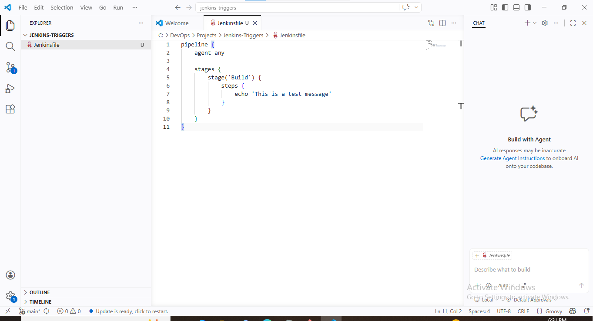
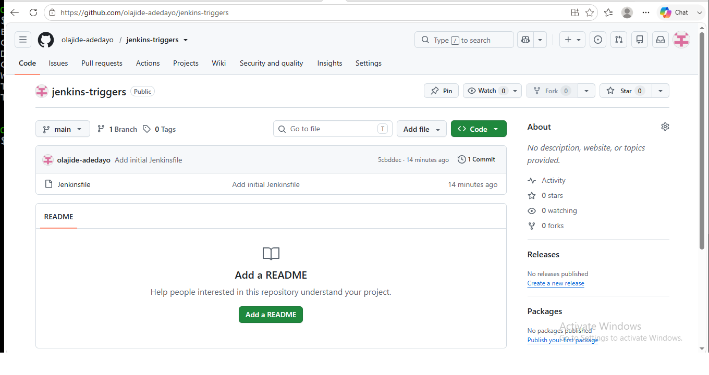
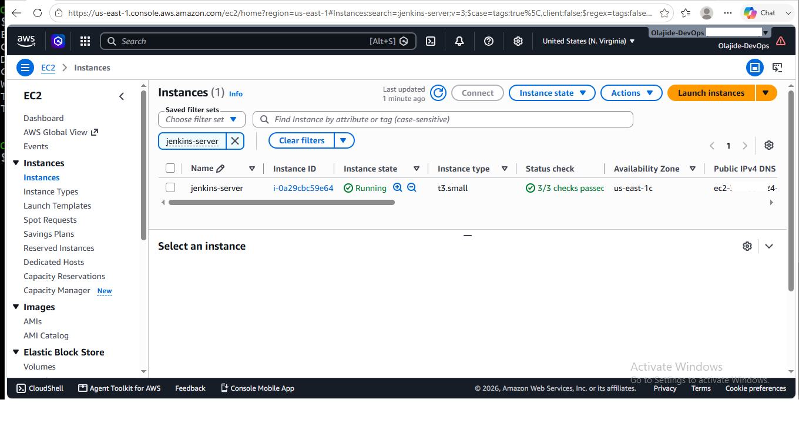
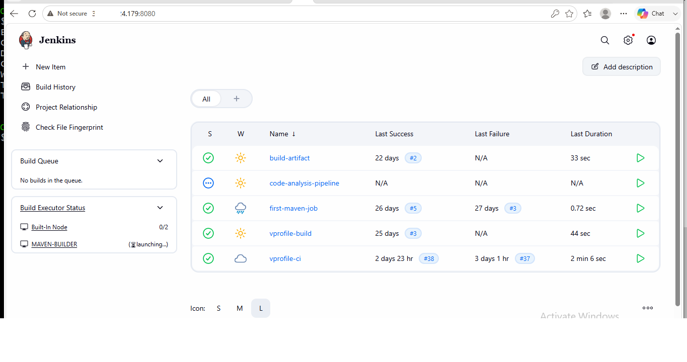
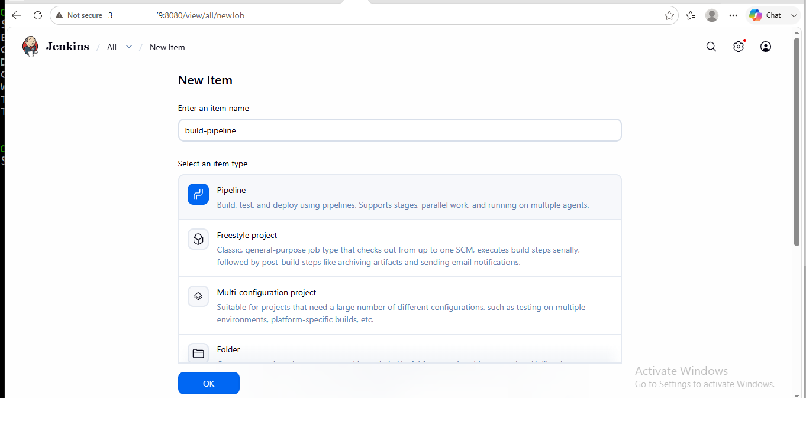
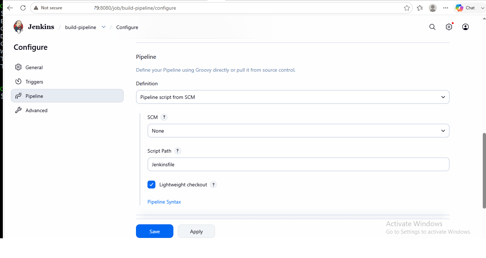
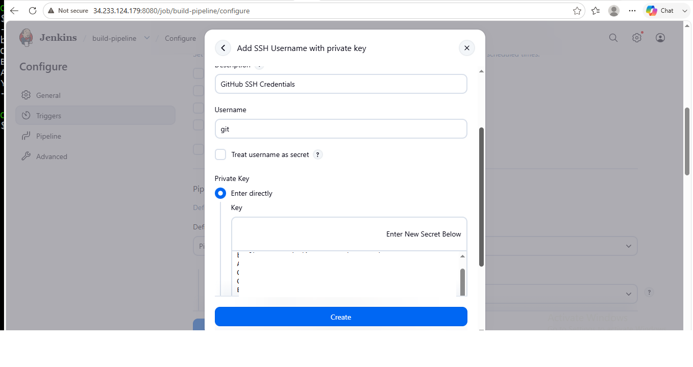
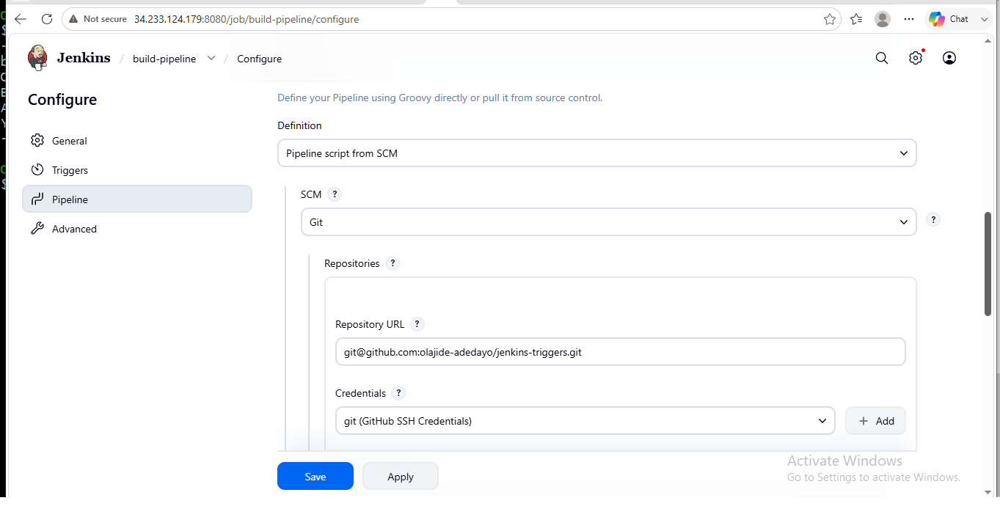
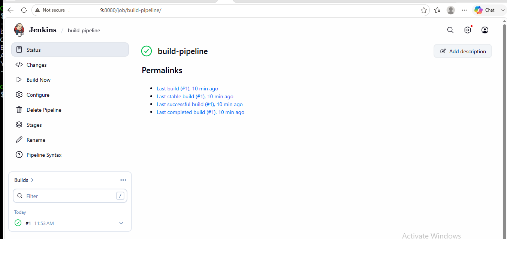
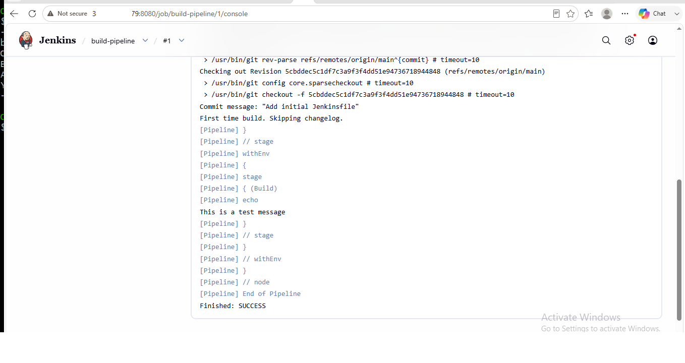

<h1 align="center">🚀 Jenkins Pipeline as Code with GitHub SCM Integration Using SSH Authentication</h1>

Building a Secure Jenkins Pipeline from GitHub Using Pipeline as Code (Jenkinsfile)

## Table of Contents

- [Project Overview](#project-overview)
- [Business Objective](#business-objective)
- [Solution Architecture](#solution-architecture)
- [Technology Stack](#technology-stack)
- [Prerequisites](#prerequisites)
- [Project Workflow](#project-workflow)
- [Implementation Steps](#implementation-steps)
- [Jenkins Pipeline Configuration](#jenkins-pipeline-configuration)
- [GitHub SCM Integration](#github-scm-integration)
- [SSH Authentication Configuration](#ssh-authentication-configuration)
- [Pipeline Execution](#pipeline-execution)
- [Project Screenshots](#project-screenshots)
- [Repository Structure](#repository-structure)
- [Troubleshooting](#troubleshooting)
- [Lessons Learned](#lessons-learned)
- [Skills Demonstrated](#skills-demonstrated)
- [Future Enhancements](#future-enhancements)
- [Author](#author)

📖 Project Overview

This project demonstrates the implementation of Pipeline as Code by integrating Jenkins with a GitHub repository using a Jenkinsfile stored in Source Code Management (SCM). Instead of defining the pipeline directly within the Jenkins user interface, the pipeline configuration is maintained in a version-controlled GitHub repository, promoting consistency, maintainability, and collaboration.

The project covers the complete setup and configuration process, including creating a GitHub repository, authoring a Jenkinsfile, configuring a Jenkins Pipeline job to retrieve the pipeline definition from GitHub using Pipeline Script from SCM, establishing secure SSH authentication, configuring Git Host Key Verification, and executing the pipeline successfully.

Upon execution, Jenkins securely cloned the GitHub repository, retrieved the Jenkinsfile from the main branch, executed the pipeline, and completed the build successfully. This implementation demonstrates an industry-standard Continuous Integration (CI) workflow where pipeline definitions are managed as code and integrated securely with a version control system.

🎯 Business Objective

Modern software development teams require a reliable, secure, and maintainable approach to managing Continuous Integration (CI) pipelines. Defining pipeline logic directly within the Jenkins user interface makes it more difficult to track changes, collaborate across teams, and maintain consistent pipeline configurations.

This project addresses these challenges by implementing Pipeline as Code, where the pipeline definition is stored as a Jenkinsfile in a GitHub repository and retrieved automatically by Jenkins during pipeline execution. This approach enables version control, improves collaboration, simplifies pipeline maintenance, and ensures that infrastructure and automation workflows are managed using the same software engineering best practices applied to application source code.

By integrating Jenkins with GitHub using SSH authentication, the project also demonstrates a secure and production-oriented method for accessing source code repositories while maintaining a streamlined Continuous Integration workflow.

🏗️ Solution Architecture

The project implements a secure Pipeline as Code workflow where Jenkins retrieves the pipeline definition from a GitHub repository using Source Code Management (SCM) and authenticates securely using SSH credentials. The pipeline is defined in a "Jenkinsfile", allowing the entire CI workflow to be version-controlled and managed as code.

Architecture Flow

Developer
     │
     ▼
GitHub Repository
(Jenkinsfile)
     │
     │  SSH Authentication
     ▼
Jenkins Pipeline Job
(Pipeline Script from SCM)
     │
     ▼
Pipeline Execution
(Build Stage)
     │
     ▼
Console Output
(Build Successful)

Architecture Components

Component| Description
Developer| Creates and updates the Jenkinsfile in the GitHub repository.
GitHub Repository| Stores the version-controlled Jenkinsfile.
SSH Authentication| Provides secure communication between Jenkins and GitHub.
Jenkins Pipeline Job| Retrieves the Jenkinsfile using Pipeline Script from SCM.
Pipeline Execution| Executes the stages defined in the Jenkinsfile.
Console Output| Displays the execution logs and final build status.

🛠️ Technology Stack

The following technologies and tools were used to implement this project:

Technology| Purpose
Jenkins| Continuous Integration (CI) server used to create and execute the Pipeline job.
Git| Version control system used to track changes to the Jenkinsfile.
GitHub| Source Code Management (SCM) platform used to host the Jenkinsfile repository.
Jenkinsfile| Pipeline as Code definition containing the pipeline stages and build logic.
Git SCM| Enables Jenkins to retrieve the Jenkinsfile directly from the GitHub repository.
SSH Authentication| Provides secure communication and authentication between Jenkins and GitHub.
Jenkins Credentials| Securely stores the SSH private key used to authenticate with GitHub.
Git Host Key Verification| Verifies the identity of the GitHub host before establishing an SSH connection.
Git Bash| Used to initialize the local Git repository, stage changes, commit, and push to GitHub.
Visual Studio Code| Source code editor used to create and manage the Jenkinsfile.

⚙️ Prerequisites

Before implementing this project, the following prerequisites were completed:

Requirement| Purpose
Jenkins Server| Installed, configured, and accessible through the Jenkins web interface.
Git Installation| Installed on both the local development machine and the Jenkins server.
GitHub Account| Used to host the repository containing the Jenkinsfile.
GitHub Repository| Created to store the Jenkinsfile under version control.
SSH Key Pair| Generated and configured to enable secure authentication between Jenkins and GitHub.
Jenkins Credentials| Configured to securely store the SSH private key for repository access.
Git Host Key Verification| Configured in Jenkins to establish trusted communication with GitHub.
Visual Studio Code| Used to create and edit the Jenkinsfile.
Git Bash| Used for Git repository initialization, staging, committing, and pushing changes.

Environment Summary

- Repository: "jenkins-triggers"
- Default Branch: "main"
- Pipeline Definition: "Jenkinsfile"
- Pipeline Type: Pipeline Script from SCM
- Authentication Method: SSH

🔄 Project Workflow

The project followed a structured workflow to implement Pipeline as Code using Jenkins and GitHub. The Jenkins pipeline definition was maintained in a GitHub repository and securely retrieved by Jenkins using Pipeline Script from SCM and SSH authentication.

Workflow Diagram

Create Jenkinsfile
        │
        ▼
Initialize Local Git Repository
        │
        ▼
Commit & Push Jenkinsfile to GitHub
        │
        ▼
Create Jenkins Pipeline Job
        │
        ▼
Configure GitHub Repository (SCM)
        │
        ▼
Configure SSH Credentials
        │
        ▼
Configure Git Host Key Verification
        │
        ▼
Retrieve Jenkinsfile from GitHub
        │
        ▼
Execute Jenkins Pipeline
        │
        ▼
Successful Build

Workflow Summary

1. A "Jenkinsfile" was created to define the pipeline.
2. The local Git repository was initialized and connected to GitHub.
3. The Jenkinsfile was committed and pushed to the GitHub repository.
4. A Jenkins Pipeline job was created using Pipeline Script from SCM.
5. Jenkins was configured to access the GitHub repository using SSH credentials.
6. Git Host Key Verification was configured to establish trusted communication with GitHub.
7. Jenkins retrieved the Jenkinsfile from the main branch.
8. The pipeline executed successfully and completed the build.

💻 Implementation Steps

The project was implemented by following a structured Pipeline as Code workflow using Jenkins, GitHub, and SSH authentication.

Step 1 – Create the GitHub Repository

- Created a dedicated GitHub repository to store the pipeline definition.
- Configured the repository to use the main branch.
- Prepared the repository for Pipeline as Code implementation.

Step 2 – Create the Jenkinsfile

- Created a "Jenkinsfile" containing the pipeline definition.
- Defined the pipeline stages using Declarative Pipeline syntax.
- Saved the pipeline definition under version control.

Step 3 – Initialize Git and Push to GitHub

- Initialized the local Git repository.
- Staged the Jenkinsfile.
- Created the initial Git commit.
- Pushed the repository to GitHub.

Step 4 – Configure the Jenkins Pipeline Job

- Created a new Pipeline project in Jenkins.
- Selected Pipeline Script from SCM as the pipeline definition.
- Configured Git as the Source Code Management (SCM) provider.
- Specified the GitHub repository URL.

Step 5 – Configure Secure GitHub Access

- Created Jenkins SSH credentials.
- Configured SSH Username with Private Key authentication.
- Selected the newly created credentials for the Pipeline job.
- Configured Git Host Key Verification to establish trusted communication with GitHub.

Step 6 – Execute the Pipeline

- Saved the Pipeline configuration.
- Triggered the initial build.
- Jenkins retrieved the "Jenkinsfile" from the GitHub repository.
- The pipeline executed successfully and completed without errors.

🔐 Jenkins Pipeline Configuration

After creating the Pipeline job, Jenkins was configured to retrieve the pipeline definition directly from the GitHub repository instead of storing the pipeline script within the Jenkins user interface.

Pipeline Configuration

Setting| Value
Job Type| Pipeline
Definition| Pipeline script from SCM
SCM| Git
Repository| GitHub Repository
Branch Specifier| "*/main"
Script Path| "Jenkinsfile"
Lightweight Checkout| Enabled

Pipeline Definition

The pipeline definition was maintained in a "Jenkinsfile" stored in the root directory of the GitHub repository. This approach follows the Pipeline as Code methodology, ensuring that pipeline changes are version-controlled alongside the project source code.

Benefits of Pipeline as Code

- Pipeline configuration is version-controlled.
- Changes are tracked using Git history.
- Jenkins configuration remains simple and maintainable.
- Team members can collaborate using a shared pipeline definition.
- Pipeline updates can be reviewed through Git commits before execution.

🔗 GitHub SCM Integration

Jenkins was configured to retrieve the pipeline definition directly from the GitHub repository using Git Source Code Management (SCM). This configuration ensures that the latest version of the "Jenkinsfile" is obtained from the repository whenever the pipeline is executed.

Repository Configuration

Configuration| Value
SCM Provider| Git
Repository Hosting| GitHub
Default Branch| "main"
Pipeline Definition| "Jenkinsfile"
Repository Access| SSH Authentication

Integration Workflow

1. Jenkins connects securely to the GitHub repository.
2. Git authenticates using the configured SSH credentials.
3. Jenkins retrieves the latest "Jenkinsfile" from the main branch.
4. The pipeline definition is loaded into Jenkins.
5. Jenkins executes the stages defined in the "Jenkinsfile".

Benefits of SCM Integration

- Maintains a single source of truth for the pipeline definition.
- Tracks pipeline changes through Git version control.
- Simplifies collaboration across development and DevOps teams.
- Ensures Jenkins always executes the latest committed pipeline definition.
- Supports repeatable and consistent pipeline execution.

🔑 SSH Authentication Configuration

To establish secure communication between Jenkins and the GitHub repository, SSH authentication was configured using Jenkins credentials. This approach eliminates the need for username/password authentication and follows industry best practices for secure repository access.

Jenkins Credential Configuration

Setting| Value
Credential Type| SSH Username with Private Key
Username| "git"
Scope| Global
Private Key| Entered directly into Jenkins
Authentication Method| SSH

SSH Authentication Workflow

GitHub Repository
        │
        │
SSH Private Key
        │
        ▼
Jenkins Credentials
        │
        ▼
Git SCM Authentication
        │
        ▼
Repository Access Granted
        │
        ▼
Jenkinsfile Retrieved

Security Configuration

The following security configurations were completed during the implementation:

- Created an SSH credential in Jenkins using SSH Username with Private Key.
- Configured the credential with Global scope.
- Associated the credential with the Pipeline job.
- Configured Git Host Key Verification to establish trusted communication with GitHub.
- Verified successful repository access after applying the required security settings.

This secure configuration enabled Jenkins to authenticate with GitHub, retrieve the "Jenkinsfile", and execute the pipeline successfully.

🚀 Pipeline Execution

After completing the Jenkins Pipeline configuration, GitHub SCM integration, and SSH authentication, the pipeline was executed successfully.

During execution, Jenkins connected securely to the GitHub repository, retrieved the "Jenkinsfile" from the main branch, interpreted the pipeline definition, and executed the configured stages without errors.

Pipeline Execution Flow

Build Now
     │
     ▼
Connect to GitHub
     │
     ▼
Authenticate Using SSH Credentials
     │
     ▼
Retrieve Jenkinsfile
     │
     ▼
Load Pipeline Definition
     │
     ▼
Execute Build Stage
     │
     ▼
Display Console Output
     │
     ▼
Build Completed Successfully

Successful Build Outcome

The first pipeline execution completed successfully and confirmed that:

- Jenkins successfully connected to the GitHub repository.
- SSH authentication was correctly configured.
- Git Host Key Verification was configured successfully.
- The "Jenkinsfile" was retrieved from the main branch.
- Jenkins interpreted and executed the pipeline definition.
- The build completed with a SUCCESS status.

Console Output Highlights

The successful console output included key execution events such as:

- Repository checkout from GitHub.
- Pipeline stage initialization.
- Execution of the configured build stage.
- Display of the pipeline test message.
- Final build status:

Finished: SUCCESS

This successful execution verified that the complete Pipeline as Code implementation was functioning correctly from source control through pipeline execution

## 📸 Project Screenshots

The following screenshots highlight the major implementation stages of the project, from creating the pipeline definition to achieving a successful pipeline execution.

### 1. Creating the Jenkinsfile

The pipeline definition was created using a Jenkinsfile in Visual Studio Code.

---

### 2. GitHub Repository with Jenkinsfile

The Jenkinsfile was committed and pushed to the GitHub repository.

---

### 3. Jenkins Server Running

The Jenkins EC2 instance was running and ready for pipeline configuration.

---

### 4. Jenkins Dashboard

The Jenkins dashboard before creating the Pipeline job.

---

### 5. Pipeline Job Configuration

The Pipeline job configuration showing the project details.

---

### 6. Pipeline Script from SCM

The Pipeline was configured to retrieve the Jenkinsfile from GitHub using *Pipeline Script from SCM*.

---

### 7. SSH Authentication Configuration

Jenkins was configured with *SSH Username with Private Key* credentials for secure GitHub access.

---

### 8. Successful Git SCM Configuration

Git SCM was successfully configured with the repository URL, branch, and SSH credentials.

---

### 9. Successful Pipeline Build

The first Pipeline build completed successfully.

---

### 10. Console Output

The Jenkins console output confirmed successful pipeline execution with a final build status of *SUCCESS*.

📁 Repository Structure

The repository is organized to separate the pipeline definition, project documentation, and supporting assets, making it easy to navigate and maintain.

jenkins-pipeline-as-code/
│
├── screenshots/
│   ├── 05-create-jenkinsfile-in-vscode.png
│   ├── 09-github-repository-with-jenkinsfile.png
│   ├── 10-jenkins-ec2-running.png
│   ├── 11-jenkins-dashboard-before-pipeline-job.png
│   ├── 12-build-pipeline-job-details.png
│   ├── 13-pipeline-script-from-scm-selected.png
│   ├── 15-ssh-username-with-private-key-configuration.png
│   ├── 16-git-scm-configuration-success.png
│   ├── 18-first-pipeline-build-success.png
│   └── 19-console-output-success.png
│
├── Jenkinsfile
└── README.md

Repository Contents

File / Directory| Purpose
"screenshots/"| Contains the screenshots used throughout the project documentation.
"Jenkinsfile"| Defines the Jenkins Declarative Pipeline used for Pipeline as Code.
"README.md"| Provides complete project documentation, implementation details, and supporting information.

🔧 Troubleshooting

During the implementation of the Jenkins Pipeline as Code project, several configuration and integration issues were encountered and successfully resolved.

Issue| Root Cause| Resolution
Failed to connect to the GitHub repository.| SSH authentication was not fully configured for the Pipeline job.| Created SSH Username with Private Key credentials in Jenkins and selected the correct credential for the Git repository.
Host key verification failed during repository validation.| Jenkins did not trust GitHub's SSH host key under the default verification settings.| Configured Git Host Key Verification in Manage Jenkins → Security → Git Host Key Verification Configuration, then saved the configuration and revalidated the repository connection.
Repository validation continued to fail after creating the SSH credential.| The newly created Jenkins credential had not been selected in the Pipeline job configuration.| Updated the Git SCM configuration to use the correct git (GitHub SSH Credentials) credential.
Repository access succeeded, but the Pipeline configuration required validation.| The Pipeline job had not yet been executed after completing the SCM configuration.| Triggered the first build using Build Now and confirmed successful retrieval of the "Jenkinsfile" and pipeline execution.

Outcome

After resolving these issues, Jenkins successfully connected to the GitHub repository using SSH authentication, retrieved the "Jenkinsfile" from the main branch, and completed the pipeline execution with a SUCCESS status.

📚 Lessons Learned

Implementing this project reinforced several important DevOps concepts and best practices related to Continuous Integration, Source Code Management, and secure pipeline automation.

Technical Lessons

- Implemented Pipeline as Code by storing the pipeline definition in a version-controlled "Jenkinsfile".
- Configured Jenkins to retrieve the pipeline definition directly from a GitHub repository using Pipeline Script from SCM.
- Established secure GitHub integration using SSH Username with Private Key credentials.
- Configured Git Host Key Verification to enable trusted SSH communication between Jenkins and GitHub.
- Successfully executed a Jenkins Pipeline and verified the build through the Jenkins console output.

DevOps Best Practices

- Store pipeline definitions in source control to improve versioning and collaboration.
- Use SSH authentication instead of less secure authentication methods for repository access.
- Validate repository connectivity before triggering pipeline execution.
- Document implementation steps and troubleshooting outcomes to improve maintainability and knowledge sharing.

Key Outcomes

- Built a secure Pipeline as Code workflow using Jenkins and GitHub.
- Strengthened practical experience with Jenkins Pipeline configuration and Git SCM integration.
- Improved troubleshooting skills by resolving real-world authentication and repository connectivity issues.
- Produced a reusable, well-documented project suitable for a professional DevOps portfolio.

🎯 Skills Demonstrated

This project demonstrates practical DevOps skills in Continuous Integration, Pipeline as Code, Source Code Management, and secure repository integration.

DevOps

- Pipeline as Code
- Continuous Integration (CI)
- Jenkins Pipeline
- Source Code Management (SCM)
- Pipeline Automation

Version Control

- Git
- GitHub
- Branch Management
- Commit Management

Jenkins

- Pipeline Job Configuration
- Pipeline Script from SCM
- Jenkins Credentials Management
- Build Execution
- Console Log Analysis

Security

- SSH Authentication
- SSH Username with Private Key
- Git Host Key Verification
- Secure GitHub Repository Access

Professional Practices

- Technical Documentation
- Repository Organization
- Troubleshooting
- DevOps Best Practices
- Version-Controlled Pipeline Management

🚀 Future Enhancements

The following enhancements could be implemented to extend the capabilities of this project:

- Configure GitHub Webhooks to automatically trigger Jenkins Pipeline builds whenever code is pushed to the repository.
- Implement Build Triggers to automate Continuous Integration workflows.
- Add email notifications to report build success or failure.
- Integrate Slack notifications for real-time pipeline status updates.
- Expand the pipeline to include additional stages such as testing, code quality analysis, and deployment.
- Integrate artifact repositories to publish and manage build outputs.
- Add support for multi-branch pipeline execution.
- Implement role-based access control (RBAC) to enhance Jenkins security and administration.

Continuous Improvement

This project establishes a solid foundation for Pipeline as Code using Jenkins and GitHub. Future enhancements will focus on increasing automation, improving security, strengthening collaboration, and expanding the CI/CD workflow toward production-ready deployment pipelines.

👨‍💻 Author

Olajide Adedayo

AWS Cloud and DevOps Engineer with hands-on experience implementing cloud infrastructure, Continuous Integration (CI), Pipeline as Code, containerization, and automation using industry-standard tools and AWS services. Passionate about building scalable, secure, and well-documented DevOps solutions while continuously expanding technical expertise through real-world projects.

Connect with Me

- GitHub: https://github.com/olajide-adedayo
- Medium: https://medium.com/@olajideadedayo230
- LinkedIn: https://www.linkedin.com/in/olajide-adedayo-9126593b3/
